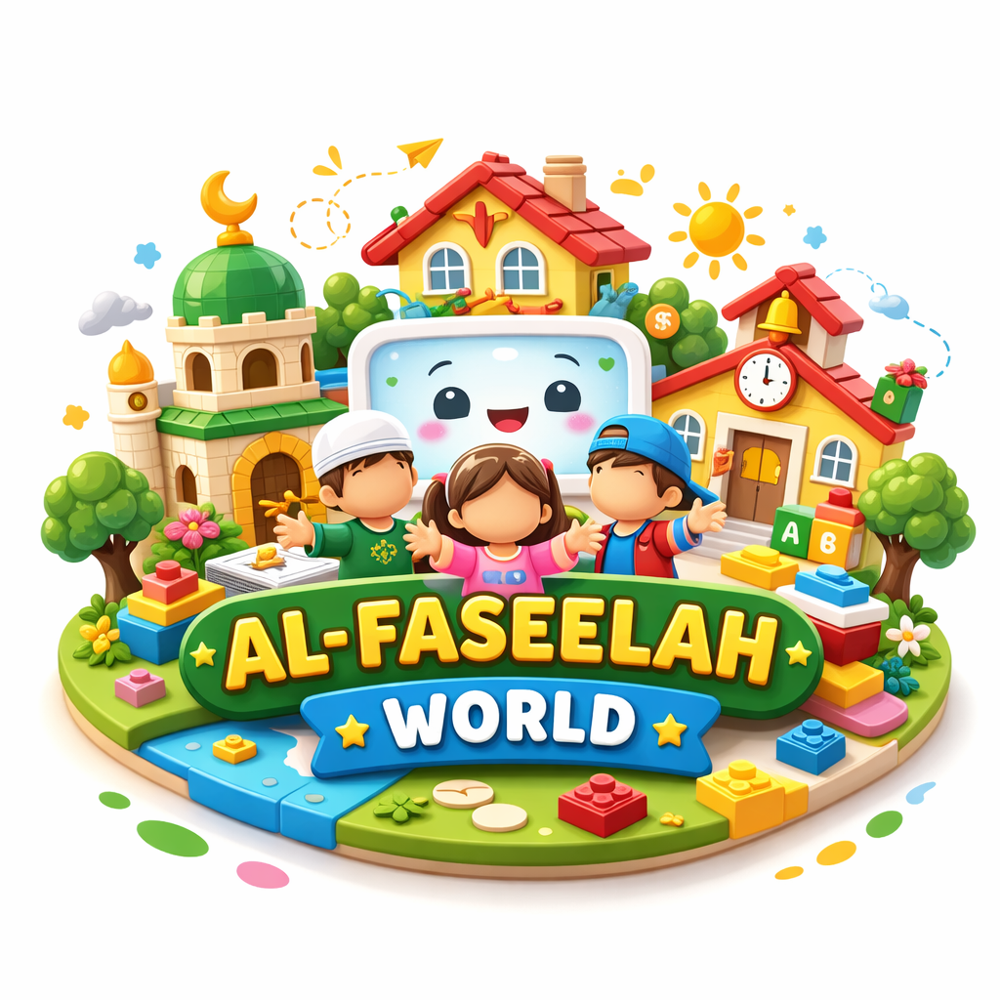

<div align="center">



# Pearant — Al-Faseelah World Parent App
#### تطبيق الأهل لعالم الفَسيلة

A bilingual (Arabic / English) **Flutter** companion app for **Al‑Faseelah World** — an
AI‑powered tangible educational toy for children aged **4–9** that teaches language,
Islamic and moral values, good manners, and positive daily behavior through physical play.


</div>

---

## 📖 Overview

**Pearant** is the parent-facing mobile application of **Al‑Faseelah World**, a graduation
project that puts modern conversational AI inside a physical, screen‑light toy. While the
child plays with the toy, the parent uses this app to manage the whole experience:
child profiles, educational content, behavior goals, progress, and session reports.

The app and the toy **never talk to each other directly for data** — they both read from and
write to the **same Supabase (PostgreSQL) cloud database**, which acts as the shared memory of
the system. Bluetooth Low Energy is used only to confirm the toy is powered on and reachable.
This makes each side robust even when the other is offline.

> **Al‑Faseelah** (الفَسيلة) means *seedling* — the toy's animated mascot who talks, teaches,
> and grows with the child.

---

## ✨ Features

- 👨‍👩‍👧 **Family accounts & child profiles** — one parent account manages multiple children
  (name, age, gender, avatar, interests, notes, and the child's physical RFID figure code).
- 📚 **Content library** — browse everything the toy can teach (~160 items) across six
  categories — *stories, activities, games, educational, behavioral, religious* — spanning the
  five play zones: **Home, Mosque, School, Zoo, Careers**. Every item is fully readable so
  parents always know what their child will hear. Favorites are prioritized during play.
- 🎯 **Behavior goals** — define a behavior to improve (e.g. *eating breakfast*, *tidying up*)
  with a target count; the toy weaves it gently into stories and games instead of lecturing.
  Progress is shown as a counter and completed goals move to achievements.
- 🏆 **Achievements** — an item‑by‑item map of everything the child has mastered (Arabic &
  English letters, numbers, colors, short Quran surahs, daily duas, family words, behaviors),
  each stamped with its completion date.
- 📊 **Session reports** — after each play session: duration, zones visited, activities
  completed, mood, focus level, and stars earned.
- 🧩 **Dynamic board selection** — pick which interchangeable board (Zoo / Careers) is mounted;
  the toy reads the selection and plays the matching content.
- 🔗 **Connectivity** — shared Supabase database (primary data path) + direct **BLE** check
  that the toy is on, using fixed service identifiers.
- 🛡️ **Parental controls, safety & privacy** — preferred content types, session language
  (Arabic / English), full content transparency, and privacy by design (the toy has no camera).
- 🌍 **Fully bilingual** — every screen works in both Arabic (RTL) and English, including
  locale-aware database content and optional English child names.
- 🌙 **Light & dark mode** — a full Material 3 dark theme, toggled from Settings and
  persisted across sessions.

---

## 🏗️ Architecture

```
┌────────────────┐        read / write        ┌──────────────────────┐
│  Pearant App   │ ─────────────────────────▶ │   Supabase (Cloud)   │
│   (Flutter)    │ ◀───────────────────────── │  PostgreSQL + Auth   │
└───────┬────────┘        shared memory        └──────────┬───────────┘
        │                                                  │ read / write
        │  BLE (is the toy powered on?)                    │
        ▼                                                  ▼
┌────────────────────────────────────────────────────────────────────┐
│   Al‑Faseelah World Toy  (Raspberry Pi 5 · RFID · reed sensors ·    │
│   Whisper STT · Gemini LLM · ElevenLabs TTS · Pygame mascot)        │
└────────────────────────────────────────────────────────────────────┘
```

The app follows a clean **layered structure**: `models` define the data shapes, `services`
hold the logic that talks to Supabase and the toy, `screens` are the UI pages, and `widgets`
are reusable components.

---

## 🛠️ Tech Stack

| Layer | Technology |
|-------|------------|
| Framework | Flutter · Dart |
| Backend & Auth | Supabase (PostgreSQL, Auth, instant REST APIs) |
| Hardware link | Bluetooth Low Energy (`flutter_blue_plus`) |
| Localization | `flutter_localizations` + generated ARB (`ar`, `en`) |
| UI | Material 3, `google_fonts` (Tajawal) |
| Local storage | `shared_preferences` |
| Permissions | `permission_handler` |

---

## 📁 Project Structure

```
lib/
├── main.dart                     # Entry point: Supabase init, light/dark themes, routes
├── app_locale.dart               # Arabic/English locale switching
├── app_theme.dart                # Light/dark theme mode switching (persisted)
├── l10n/                         # Generated localizations (ar, en)
├── models/                       # Data models (child, session, report, zone, ...)
├── services/                     # Business logic + data access
│   ├── supabase_service.dart         # Supabase auth wrapper
│   ├── auth_service.dart             # Sign in / sign up / profile
│   ├── child_service.dart            # Child profiles & sessions
│   ├── content_library_service.dart  # Content, favorites, preferences, achievements
│   ├── behavior_goal_service.dart    # Behavior goals
│   ├── board_service.dart            # Dynamic board (zones/pieces) + set_active_board RPC
│   └── ble_service.dart              # BLE link to the toy
├── screens/                      # 19 UI screens
└── utils/                        # Bilingual strings & theme-aware colors
```

*~19k lines of Dart · 19 screens · 7 services · fully bilingual · light & dark themes.*

---

## 🗄️ Database (Supabase / PostgreSQL)

The database is grouped into **World**, **Family**, and **Tracking** tables. The `children`
table is the hub that links a child's family data to their play and progress.

| Group | Tables |
|-------|--------|
| **World** | `zones`, `pieces`, `content` |
| **Family** | `profiles`, `children`, `parent_preferences`, `child_saved_content` |
| **Tracking** | `behavior_goals`, `sessions`, `achievements` |

A PostgreSQL function `set_active_board(target_zone_key)` toggles the currently mounted
dynamic board.

---

## 🚀 Getting Started

### Prerequisites
- [Flutter SDK](https://docs.flutter.dev/get-started/install) (Dart `^3.7`)
- An Android/iOS device or emulator
- A Supabase project (URL + publishable/anon key)

### Run

```bash
git clone https://github.com/<your-username>/pearant-app.git
cd pearant-app
flutter pub get
flutter run
```

### Configure Supabase
Credentials are kept **out of version control**. Copy the example config and fill in
your own values:

```bash
cp lib/config/supabase_config.example.dart lib/config/supabase_config.dart
```

Then open `lib/config/supabase_config.dart` and set your **Project URL** and
**publishable / anon key** (*Supabase Dashboard → Settings → API*). This file is
gitignored and never committed.

> 🔒 **Security note:** the app uses only the **public anon / publishable key**, whose
> access is restricted by **Row Level Security (RLS)** policies in the database. The
> **secret / `service_role`** key is never used in the client nor committed to this repo.

---

## 👩‍💻 Author & Credits

**Fatima Azazmah** — *B.Sc. Computer Science, Birzeit University (2026)*
Designed and developed the complete Flutter parent application and its Supabase/PostgreSQL
integration, and contributed to the AI, Python (Raspberry Pi), and hardware components of the
wider system.

This app is part of the graduation project **“Al‑Faseelah World: An AI‑Powered Tangible
Educational System with a Parent Companion App for Language, Values, and Behavioral Learning,”**
completed with **Rawaa Hammad** under the supervision of **Dr. Hanna Balata**, Department of
Electrical and Computer Engineering, Birzeit University — July 2026.
